# 확장 계획 — "영상 만드는 툴 아니냐"에 대한 답

작성 2026-09-23. 다음 세션에서 이 문서만 읽고 시작할 수 있도록 결정·근거·순서·검사를 모두 적는다.
기준 커밋은 `758ec02 고도화 4차`(38장·69단계, 35~38 finale 재구성까지 반영)다.

## 0. 왜 하는가

청중은 AI가 중요한 건 알지만 "AI 슬롭"이라고 깎아내리는 고학력 차부장급이다. 지금 흐름은 17~25번에서 목소리·이미지·음악 결과물이 연달아 나와서
"결국 영상·목소리 만드는 툴이네", "AI로 할 바엔 사람이 낫지"로 정리될 틈이 있다. 이 틈을 네 가지로 막는다.

1. **구조로 답한다.** 자비스는 툴 모음이 아니라 공장이다. 비싼 프론티어 모델은 판단이 필요할 때만 부르고, 반복하는 일은 각 일에 맞춘 로컬 모델이 대기하다가
   맡는다. 각자 자기 일만 한다. 이 구조의 정식 이름은 **Compound AI System**(Berkeley BAIR, 2024)이고, 비싼 모델과 싼 모델 사이에서 요청을 나누는 것은 **LLM 라우팅**이다.
2. **동기로 답한다.** 31살, 앞으로 30년을 벌어서 살아야 하는 과도기 사람이다. "다 할 수 있다"는 쾌락과 "대체될 수 있다"는 두려움이 동시에 있다.
   디지털 월세는 이미 월 20만원을 넘었다.
3. **확장으로 답한다.** 같은 설계가 목소리(TTS 엔진), 업무(RICE), 주식(Personal CIO)에 이미 들어가 있다. 영상 공장 × 주식 프로그램 같은 조합이 계속 생기고,
   사무직이라면 엑셀·브라우저·PDF↔PPT·문서 가로↔세로부터 만들었을 것이다. → 38번(새 43번) "여러분이라면?"이 청중 자신의 일이 된다.
4. **속도로 답한다.** 사용자가 이 업계에서 가장 좋아하는 말: **"지금 쓰고 있는 모델이 (앞으로 쓸 모델 중) 제일 구린 모델이다."**
   모델은 날마다 나아지고, 하드웨어는 좋아지고, 최적화되고, 대중화된다. "AI로 할 바엔 사람이 하는 게 낫다"는 지금은 맞을 수 있다. 그런데 1년 뒤엔? 2년 뒤엔?
   **2~3번의 고양이 사진은 원래 이 말을 위해 넣은 것이다**(사용자 의도). 한때는 사진 한 장 → 단어 하나, 지금은 요청 한 문장 → 강의 한 편, 그다음은?

**척추 문장:** "비싼 지능은 판단에만 빌려 쓰고, 생산은 소유합니다." (강의자료 `script/course/ch06.md`의 "지능은 임대하고, 생산은 소유합니다"를 라우팅에 맞게 다듬은 것)

## 1. 사용자가 확정한 것

| 항목 | 결정 |
| --- | --- |
| 나이 | **31세**(1995년생). 기존 "서른두 살"·"32세"는 오타. 13번 눈금은 31세 → 61세 |
| 프론티어 모델 | 쓰지 않겠다는 것이 아니다. **라우팅**: 프론티어는 비싸서 판단에만, 로컬 모델은 "꼬봉"으로 각 태스크에 최적화돼 대기. 그래서 "공장" |
| RICE | IBM TEL 조직 대상 발표라 보여줘도 된다. README의 "IBM 내부용" 문구는 사용자가 걷어내고 오픈소스로 공개할 예정 → 화면에 그 문구를 인용하지 않는다 |
| 언어학자 관점("신에게 목줄") | 출처를 찾지 않는다. **발표자 본인의 질문**으로 쓴다(어디서 들은 이야기에 본인 생각을 더한 것) |
| 디지털 월세 근거 | 루트의 `claude 지출.png`, `codex 지출.png`. Claude는 API(추가 사용량) 쪽이 더 극적이라 그 화면을 줬다 |
| 주식 프로그램 | `/Users/jaehoseo/Desktop/vswrk/money`(Personal CIO). 영상 공장과의 조합 가능성을 보여준다 |
| 사무직 가정 | "제가 사무직이었다면" 엑셀 자동화, 브라우저 조작(browser use), PDF↔PPT 변환기, 문서 가로↔세로 변환기 |
| 가장 좋아하는 말 | "지금 쓰는 모델이 제일 구린 모델이다." 고양이 사진(2~3번)이 이 말의 복선. 실제 결과물 직후 새 장(29번)으로 회수한다 |
| 머스크 사진 | 루트의 `elon.png`는 쓰지 않는다. 인용은 글자로만(4절 14번) |

## 2. 무대에서 말하지 않을 것 (중요)

- **유료 종목 토론방·리딩방.** 유사투자자문업 신고가 필요하고, 2024년 8월 자본시장법 개정 뒤 양방향 유료 리딩방은 투자자문업 등록 없이 할 수 없다(확인 후에도 무대에서는 뺀다).
  바로 앞이 사기 구간이라 "리딩방"은 청중 머릿속에서 사기와 붙는다.
- **"무료로 풀어 데이터를 모아 금융사에 판매".** 개인정보·신용정보 동의 문제이고, 41번(구 36번)의 "동의를 먼저 확인합니다" 약속과 부딪힌다.
  말한다면 "동의받은 데이터가 쌓이면 그 자체가 자산" 정도까지.
- **구체적 수익화 계획, 수익률, 거래내역.** 사내 발표라 사외 활동 규정 질문을 부를 수 있다. "파생 가능성"으로만. `money/거래내역서_*.pdf`는 절대 쓰지 않는다.
- **머스크 발언의 의역.** "10년 후 황금기", "생산이 소비를 뛰어넘어", "모두가 고액연봉자"는 원문 표현이 아니다. 확인된 원문만 쓴다(5절 F1~F3).
- **영수증 화면의 사이드바.** `claude 지출.png` 왼쪽에 대화 제목 목록이 보인다. 반드시 잘라낸다.
- **"월세 때문에 로컬로 생산한다"를 영수증이 증명한다고 말하지 않기.** 영수증은 Claude Code(코딩 에이전트) 사용이 100%다. 즉 "프론티어는 비싸다"의 증거이지,
  TTS 생성 비용이 아니다. 대본은 "만드는 데만 이만큼 나갑니다 → 그래서 매일 반복하는 생산은 로컬 모델에게"로 쓴다.

## 3. 흐름도

### 3-1. 감정의 3막

```mermaid
flowchart LR
  subgraph A["1막 · 쾌락 — 다 할 수 있다"]
    A0["2~3 고양이: 사진 한 장 → 단어 하나 / 요청 한 문장 → 강의 한 편 (복선)"] --> A1["4~12 AI의 현재·다음 시장"]
    A1 --> A2["13 31세, 30년 눈금"] --> A3["14 과도기 NEW"]
    A3 --> A4["15~17 실제 제작 기록 · 사용자는 저 한 명 · Agent OS 고리"]
    A4 --> A5["18 공장 안: 라우팅 NEW"] --> A6["19 결국 영상 만드는 거 아닌가요? NEW"]
    A6 --> A7["20~28 갤러리 · Blender 영상 · 실제 결과물"] --> A7b["29 지금이 가장 구린 모델 NEW (고양이 회수)"]
    A7b --> A8["30 이 발표도"]
  end
  subgraph B["2막 · 두려움 — 남도 다 할 수 있다"]
    B1["31~38 제 목소리 · 사칭 · 조작 · 확인"] --> B2["39 신에게 목줄 NEW"]
  end
  subgraph C["3막 · 과도기의 선택 — 제 집을 짓는다"]
    C1["40 모델이 바뀌어도 남는 것"] --> C2["41 과정 공개"] --> C3["42 공장은 계속 늘어난다 REBUILD"] --> C4["43 만들기 · 맡기기"]
  end
  A8 --> B1
  B2 --> C1
  A0 -. 복선 .-> A7b
```

### 3-2. 새 순서 (38장 → 43장)

| 새 번호 | id | 상태 | 이전 번호 | 한 줄 |
| --- | --- | --- | --- | --- |
| 1~12 | (변경 없음) | 유지 | 1~12 | 2~3번 고양이는 29번의 복선 |
| 13 | manifesto-person | **수정** | 13 | 서른두 → 서른한 살, 눈금 61세까지 |
| 14 | manifesto-transition | **신규** | — | 과도기: 머스크 "일은 선택" · 쾌락과 두려움 · 인지 부채 |
| 15 | manifesto-compute | 유지 | 14 | 실제 강의 24초 제작 기록 |
| 16 | manifesto-requirements | 유지 | 15 | 사용자는 저 한 명 |
| 17 | manifesto-system | 대본만 | 16 | 저 → Agent OS → Factory → 저 |
| 18 | manifesto-factory | **신규** | — | 공장 안: 라우팅, 대기 중인 모델들, 디지털 월세 |
| 19 | manifesto-bets | **신규** | — | "결국 영상 만드는 거 아닌가요?" → 제 베팅 |
| 20 | factory-repositories | 유지 | 17 | 결과물 갤러리 |
| 21~25 | factory-* | **변경 금지** | 18~22 | Blender 영상(사용자 승인) |
| 26~28 | demo-tts/assets/music | 유지 | 23~25 | 실제 결과물 재생 |
| 29 | manifesto-worst-model | **신규** | — | "AI로 할 바엔 사람이 낫지 않나요?" → 지금 쓰는 모델이 가장 구린 모델 |
| 30 | tel-this-presentation | 유지 | 26 | |
| 31~38 | abuse-* | 대본 번호만 | 27~34 | 무서운 구간 |
| 39 | abuse-leash | **신규** | — | 신에게 목줄이 걸릴까 (발표자의 질문) |
| 40 | manifesto-remains | 대본 첫 문장 | 35 | 목줄 질문에 대한 답으로 시작 |
| 41 | tel-sharing | 유지 | 36 | |
| 42 | tel-unfinished | **재구성** | 37 | 설계도 → 조합 → 사무직이었다면 → 끝없는 방 |
| 43 | tel-invitation | 유지 | 38 | 만들기 · 맡기기 |

단계 수(예상): 69 + 14번 3 + 18번 3 + 19번 2 + 29번 3 + 39번 2 + 42번 추가 2 = **약 84**. 구현 후 `check:keynote`로 확정하고 README에 적는다.

## 4. 장별 상세

시각 원칙(사용자 평가): 3D·Blender 공간이 최고, 평면 PPT가 최악. 승인된 문법 — 2·3번 입자 변형, 14번(새 15번) 실제 데이터 타임라인, 16·17번 three.js 고리와 전시.
새 장은 가능한 한 이 문법을 이어 쓴다. 색 규칙: 파랑 = 기계, 금색 = 사람·결론, 빨강 = 사실이 아님·합성.

### 13 · manifesto-person (수정)
- `src/keynote/personal/PersonalIntro.tsx` aria-label "2026년 서른두 살부터 2056년 예순두 살까지" → 서른한 살·예순한 살. 화면 눈금 글자도 확인.
- 대본 `script/keynote/manifesto.md` manifesto-person "서른두 살" → "서른한 살".
- FACT-CHECK 13행의 "(만 나이로는 생일에 따라 31세일 수 있다)" → "1995년생·31세는 발표자가 제시한 값".
- 강의자료 쪽(`src/production/chapters/ch01-open.ts` "32세", `script/course/ch06.md` "32세의 목표")은 별도 강의라 **사용자에게 물은 뒤** 고친다.

### 14 · manifesto-transition 「과도기」 (신규, steps 2)
- **무대:** 13번과 같은 배경(`public/house-scroll/a7.jpg`)과 30년 눈금을 이어 쓴다. 13·14를 한 묶음(group `person-ruler`)으로 만들어 배경·눈금 DOM이 유지되게 하는 것이 가장 자연스럽다
  (`PersonalIntro`에 `part` 추가). 13번은 이미 사용자에게 무난한 평가였으므로 13번 화면 자체는 바꾸지 않는다.
- **0단계:** 눈금 위 10~20년 뒤 구간(2036~2046)에 표식이 선다. 확인된 원문 인용(F1~F3) 한 줄. 제목 "누군가는 곧 일이 선택이 된다고 말합니다".
  - **인물 사진은 쓰지 않는다.** 인용은 글자로만: 원문 영어 한 줄 + 한국어 번역 + "일론 머스크 · X, 날짜" 출처. X 게시물 화면을 흉내 낸 카드도 만들지 않는다(실제 기록처럼 보이는 가짜 캡처가 되므로).
  - 루트의 `elon.png`(600×347, 보도사진에 X 로고를 합성한 썸네일, 원 출처 불명)는 해상도·출처·"뉴스 썸네일" 인상 때문에 사용하지 않는다(2026-09-23 결정).
- **1단계:** 지금(2026)부터 그 구간까지가 금색으로 칠해지며 "과도기" 라벨. 제목 "그래도 저는 과도기에 사는 사람입니다", 설명 "그 사이 30년도 벌어서 살아야 합니다."
  양쪽에 두 낱말: **다 할 수 있다**(금색, 쾌락) / **대체될 수 있다**(파랑, 기계). 빨강은 쓰지 않는다(사실이 아님을 뜻하므로).
- **2단계:** "일이 선택이 되면, 생각도 선택이 됩니다." 작은 근거 카드 — MIT 미디어랩, LLM으로 글을 쓴 그룹의 뇌 연결성이 가장 약했고 자기 글을 인용하지 못한 비율이 높았다
  (F5, 54명·에세이 과제·동료심사 전이라는 한계를 카드에 같이 적는다). 결론 "그래서 판단은 제가 쥡니다." → 15~17번과 41번(과정 공개)의 "직접 듣고 고른다"가 왜 반복되는지 설명된다.
- 모션 끄기(M): 각 단계의 마지막 상태.

### 17 · manifesto-system (대본만)
- 끝에 다음 장으로 넘기는 한 문장: "Factory 안을 들여다보겠습니다."

### 18 · manifesto-factory 「공장 안」 (신규, steps 2) — 이번 확장의 핵심 장면
- **무대:** 16·17번 three.js 공간(`src/keynote/personal/world.ts`, group `one-user`)을 이어 쓴다. 17번 마지막 상태에서 카메라가 Factory 노드 안으로 들어간다.
  `OneUserStory`의 `part`를 `0 | 1 | 2`로 늘리고 phase 5~7을 추가한다. 이게 무리면 `stage3d/runtime.ts`로 새 장면을 만들되 같은 색·선 언어를 쓴다.
- **0단계 — 대기 중인 스테이션:** 바닥의 고리 위에 스테이션들이 늘어서 있고 각자 불이 꺼진 채 대기한다. 요청 빛이 들어오면 맞는 스테이션 하나만 켜진다.
  - 목소리: Qwen3-TTS 1.7B + 제 목소리 어댑터(0.60)
  - 받아쓰기 검수: Whisper(독립 판독)
  - 이미지·3D: Local Assets Engine의 모델(이름은 F10으로 확인)
  - 음악: Local Music Engine의 모델(F10)
  - 업무 에이전트: RICE — Ollama 위 로컬 모델(README 권장 `qwen3.6:35b-a3b-q4_K_M`, 실제 사용 모델은 F10)
  - 위쪽에 따로 떨어진 문 하나: **프론티어 모델** — "판단이 필요할 때만". 어려운 판단 요청만 이 문으로 올라갔다 내려온다.
  - 스테이션 라벨은 투영 DOM(`.iw-label`)으로. 구현된 것은 실선·"개발 중", Agent OS 라우팅은 점선·"구상"(16·17번과 같은 기준, F10에서 RICE 라우팅 구현 범위 확인).
- **1단계 — 디지털 월세:** 프론티어 문 옆에 영수증 두 장이 떨어진다(잘라낸 실제 화면).
  - Codex Pro 플랜 ₩159,000/월
  - Claude 이번 달 추가 사용량 US$72.77 (월 한도 US$76)
  - 합계 문구는 "디지털 월세 **월 20만원 이상**"(환율과 무관하게 참: 159,000원 + US$72.77). 제목 "비싼 지능은 판단에만 빌려 씁니다".
- **2단계 — 이름 붙이기:** "그래서 공장입니다. 각자 자기 일만 합니다." 작은 주석 "이런 구조를 Compound AI System이라고 부릅니다 — Berkeley BAIR, 2024"(F6).
  선택: LLM 라우팅 연구(RouteLLM)의 비용 절감 수치(F7). 수치를 쓰면 반드시 조건(벤치마크명·기준 모델)을 함께 적는다.
- 대본 요지: 프론티어를 버리는 게 아니다. 비싸니까 판단에만. 매일 반복하는 생산은 제 컴퓨터에서 각자 맞춘 모델이. 새 일이 생기면 스테이션을 하나 더 들이면 된다.

### 19 · manifesto-bets 「결국 영상 만드는 거 아닌가요?」 (신규, steps 1)
- **0단계:** 화면 가운데 청중의 속마음을 큰 인용으로. *"결국 영상 만드는 거 아닌가요?"* (회색, 발표자가 읽는다). 뒤로는 18번 스테이션들이 흐리게 남아 있다
  (18번과 같은 묶음이면 가장 좋다).
- **1단계 — 제 베팅 세 개**("발표자의 판단" 표시):
  1. 소프트웨어는 만들기 쉬워질수록 값이 떨어집니다. 사람이 보고 듣는 결과물 — 목소리·영상·2D·3D·음악 — 은 기술이 발전해도 계속 돈을 받는 일이라고 봤습니다.
  2. 과도기에는 이름이 곧 포트폴리오입니다. (41번 "과정 공개"로 이어진다. "유명해지자"라는 말은 대본에만, 화면에는 쓰지 않는다)
  3. 스테이션은 갈아 끼울 수 있습니다. 공장이 본체입니다. (29번 "모델은 계속 좋아진다", 42번 확장의 복선)
- 다음 장(20 갤러리)으로 "그래서 먼저 만든 스테이션들의 결과물입니다."

### 29 · manifesto-worst-model 「지금이 가장 구린 모델」 (신규, steps 2)
- **자리:** 실제 결과물 세 편(26~28) 바로 뒤, 30번(이 발표도) 앞. 결과물의 어색한 곳을 청중이 막 보고 들은 순간이 "AI로 할 바엔 사람이 낫지"라는 생각이 가장 강할 때다.
  28번 음악은 청취 승인 전 개발 후보라서, 여기서 먼저 인정하는 게 자연스럽다.
- **무대:** 2~3번 three.js 공간(`src/keynote/opening/world.ts`, `CatScene.tsx`)의 입자 문법을 다시 부른다(회수). 같은 world 코드를 새 인스턴스로 재사용한다(2~3번 묶음과는 멀리 떨어져 있으므로 묶음은 아님).
- **0단계 — 인정:** 청중의 속마음을 먼저 화면에. *"AI로 할 바엔, 사람이 하는 게 낫지 않나요?"* → "네. 지금은 그럴 수 있습니다."
- **1단계 — 고양이 회수:** 검은 공간에 2번의 화소 부조 고양이가 다시 떠오르고 금색 입자 "고양이"가 된다(한때: 사진 한 장 → 단어 하나).
  입자가 3번의 강의 화면 테두리로 모인다(지금: 요청 한 문장 → 강의 한 편). 그다음 입자가 앞쪽 빈 어둠으로 흘러가며 눈금 "1년 뒤?" "2년 뒤?"가 선다.
  제목 **"지금 쓰는 모델이, 앞으로 쓸 모델 중 가장 구린 모델입니다."** 작은 표시 "이 업계에서 자주 하는 말"(+ 출처 F15, 확인되면 이름을 붙이고 아니면 표시만).
- **2단계 — 그래서:** 근거 한 줄(선택, F16): 같은 성능의 추론 비용이 해마다 크게 떨어진다는 추정 — 조건을 반드시 함께 적는다.
  발표 안의 사실로 대신해도 된다: 제가 쓰는 Qwen3-TTS도 "3초 음성 복제"를 내세우며 2026-01 공개된 모델이다(이미 FACT-CHECK에 있음, 31번에서 다시 나온다 → 무서운 구간의 복선도 된다).
  결론 "그래서 저는 모델에 걸지 않습니다. 모델이 좋아질수록 같이 좋아지는 공장에 겁니다." → 18번 스테이션 교체, 40번 모델 흐름과 연결.
- **고양이 연도:** 2~3번 대본은 "한때는"이라고만 하고, FACT-CHECK는 고양이 사진이 특정 역사적 논문의 자료라고 주장하지 않는다. 여기서도 연도를 붙이지 않고 "처음에 보여드린 고양이 사진"으로 부른다.
- 색: 고양이·강의 입자는 2~3번과 같은 금색, "1년 뒤?" 눈금은 파랑(기계의 다음 세대). 모션 끄기에서는 세 지점이 모두 보이는 마지막 상태.
- 40번(구 35번) 모델 흐름에는 화면 변경 없이 대본에서 한 번 더 받는다: "지금 이 모델이 가장 구린 모델이라고 말씀드렸죠."

### 39 · abuse-leash 「신에게 목줄」 (신규, steps 1)
- **자리:** 38번(확인하는 방법) 뒤, 40번 새벽 직전. 사기 장면들 사이에 넣지 않는다(구체적이라서 무서운 흐름을 철학이 흐리게 만든다).
  "남이 악용한다"에서 "그래서 저는 제 집을 짓는다"로 넘어가는 마지막 공포다.
- **무대:** 2·3번 입자 문법을 **거꾸로** 쓴다(`src/keynote/opening/world.ts`의 입자 코드 참고). 2번에서는 사진이 단어가 됐다. 여기서는 단어가 모여 몸이 된다.
  검은 공간에 한국어·영어 낱말 조각(파랑 = 기계)이 흘러와 사람 형태의 실루엣을 이룬다. 1단계에서 금색 고리(사람이 채우려는 목줄)가 목을 감으려다 닫히지 않고 흩어진다.
  새 폴더 `src/keynote/leash/`, `stage3d/runtime.ts` 사용. 모션 끄기에서는 실루엣과 열린 고리가 멈춘 마지막 상태.
- **글(발표자의 질문으로 표시, 출처 없음):**
  - 0단계: "실리콘밸리는 ‘AI’라는 이름의 신을 만들면서, 노예의 목줄을 채우려 합니다."
  - 1단계: "신에게 목줄이 걸릴까요?" / "우리를 움직여 온 언어에, 우리는 지금 몸을 만들어 주고 있는 건 아닐까요?"
  - 작은 사실 주석(선택, F8): 지금 로봇의 두뇌는 실제로 언어 모델에서 출발한다(VLA, 예: Gemini Robotics). 비유가 SF로 치부되지 않게 받친다.
  - 선택(F4): 황금기를 말한 머스크가 2014년에는 "AI는 악마를 소환하는 일"이라고 했다 — 14번과 대구. 과하면 뺀다.
- 배경 팔레트: 31~38(구 27~34)의 붉은 방이 아니라 완전한 검정 + 파랑 입자 + 금색 고리. 빨강은 쓰지 않는다.
- 40번 대본 첫 문장을 바꾼다: "신에게 목줄을 채울 수 있을지는 저도 모르겠습니다. 제가 할 수 있는 건, 비싼 신은 꼭 필요할 때만 부르고 제 집을 짓는 겁니다."

### 42 · tel-unfinished 「공장은 계속 늘어난다」 (재구성, steps 2)
- **무대:** 지금의 평면 SVG 설계도(`Finale.tsx` `Blueprint`)를 3D로 올린다. 12번 집의 청사진 격자 언어, finale 묶음의 푸른 새벽 배경 위.
  방이 격자에서 솟아오르는(extrude) 연출. `stage3d/runtime.ts`. finale 묶음의 배경 DOM(`.fn-sky`)은 유지해야 하므로 캔버스는 배경 위 층으로 얹는다.
- **0단계 — 정직한 현재:** 지어진 방 TTS·ASSETS·MUSIC("개발 중"), **RICE**("만듦 · 로컬 업무 에이전트"), **Personal CIO**("만듦 · 주식 판단 기록").
  Agent OS 복도는 점선("구상"). 제목 "완성된 자비스까지는 갈 길이 있습니다"(기존 유지).
  - RICE 방의 벽에 실제 RICE 소개 영상이 소리 없이 재생된다. 이 영상 자체가 공장이 화면을 찍고 대본을 쓰고 제 목소리로 만든 결과물이다(A2).
  - Personal CIO 방에는 README 한 줄: "모델은 교체할 수 있고… 데이터와 과거 평가를 로컬 자산으로 남긴다", "실제 주문은 사용자가 최종 결정한다"(F11).
- **1단계 — 조합:** 방과 방 사이에 빛이 흐르며 조합이 생긴다. 영상 공장 × Personal CIO → "주식 분석 영상 · 분석 서비스 · 제 투자 판단 기록".
  목소리 × 강의 → "강의 채널"(이미 한 것). 금지 목록(2절)은 넣지 않는다. 라벨 옆에 "가능성" 표시.
- **2단계 — 사무직이었다면:** "제가 사무직이었다면 이것부터 만들었을 겁니다." 점선 방 네 개: 엑셀 자동화 · 브라우저 조작 · PDF↔PPT · 문서 가로↔세로.
  카메라가 물러나며 같은 복도에 점선 방이 지평선까지 이어진다. 제목이 "그리고 방은 계속 늘어납니다"로 바뀐다. 그대로 43번 질문으로.
- 공통 노트 세 줄(01 연결 / 02 품질 / 03 생활)은 0단계에 남기거나 대본으로 옮긴다.

### 43 · tel-invitation (유지)
- 화면 변경 없음. 대본 앞에 한 문장: "방금 네 개의 빈 방은 제 가정이었습니다. 여러분의 빈 방은 무엇일까요?"

## 5. 사실 확인 목록 (구현 전에 먼저)

모두 FACT-CHECK.md에 행으로 남긴다. 확인 못 하면 화면에서 빼거나 "발표자의 판단"으로 표시한다.

| # | 내용 | 확인할 원문 | 쓰는 곳 |
| --- | --- | --- | --- |
| F1 | 머스크 VivaTech 2024(2024-05-23): "universal high income"(기본소득이 아니라 고소득), "probably none of us will have a job", 삶의 의미 질문 | 행사 영상 또는 CNN 등 원 보도 | 14 |
| F2 | 머스크 X 게시물 "AI+Robots will be able to do everything, resulting in universal high income. Work will be optional." | https://x.com/elonmusk/status/2072700088481182100 (날짜 확인) | 14 |
| F3 | "10~20년 안에 일은 선택" | 2025-11 미국·사우디 투자 포럼 발언 보도(날짜·문장 확인) | 14 눈금 위치 |
| F4 | (선택) "With artificial intelligence we are summoning the demon" | MIT AeroAstro 100주년 심포지엄 2014-10 | 39 |
| F5 | MIT 미디어랩 "Your Brain on ChatGPT" — 54명, 32채널 EEG, LLM 그룹의 연결성 최저, 자기 글 인용 실패 비율 | https://arxiv.org/abs/2506.08872 (2025-06, 2025-12 개정), 동료심사 전 | 14 |
| F6 | Compound AI Systems | https://bair.berkeley.edu/blog/2024/02/18/compound-ai-systems/ | 18 |
| F7 | (선택) RouteLLM 비용 절감 수치와 조건 | LMSYS 블로그·논문(2024-07) | 18 |
| F8 | (선택) VLA — 언어 모델에서 출발한 로봇 모델(Gemini Robotics 등) | Google DeepMind 발표(2025-03) | 39 |
| F9 | 영수증 두 장: Codex Pro ₩159,000/월, Claude 추가 사용 US$72.77 / 한도 US$76, Claude Code 100% | 루트 `codex 지출.png`, `claude 지출.png` (2026-09-23 캡처) | 18 |
| F10 | 스테이션별 실제 로컬 모델 이름·구현 범위 | 각 엔진 README(`javis/local-tts-engine`, `local-assets-engine`, `local-music-engine`), `bob/rice/rice-runtime`의 모델 호출·라우팅 코드 | 18, 42 |
| F11 | Personal CIO README 문장 | `/Users/jaehoseo/Desktop/vswrk/money/README.md` | 42 |
| F12 | RICE 한 줄 소개 "일하며 만든 업무 방식을 재사용 가능한 자산으로 축적…" | `bob/rice/README.md` (IBM 내부용 문구는 인용하지 않는다) | 42 |
| F13 | RICE 소개 영상 출처 | `javis/local-tts-engine/output/edits/2026-09-21/rice-first-run/` (09-21 목소리 승인, `docs/DECISIONS.md`) | 42 |
| F14 | 유사투자자문업·양방향 리딩방 규정 | 금융위원회 보도자료(2024-08 시행 자본시장법 개정) — **무대에서 빼는 근거로만** | 없음 |
| F15 | "지금 쓰는 AI가 앞으로 쓸 AI 중 가장 나쁜 AI" 계열의 말 — Ethan Mollick『Co-Intelligence』(2024)의 "Assume this is the worst AI you will ever use", OpenAI 제품 책임자 Kevin Weil의 비슷한 발언 | 책 원문·인터뷰 원문. 누구의 말로 붙일지 하나만 확인되면 그 이름으로, 아니면 "이 업계에서 자주 하는 말"로만 | 29 |
| F16 | (선택) 같은 성능의 LLM 추론 비용 하락 속도 — a16z "LLMflation"(2024-11, 해마다 약 10배로 추정), Epoch AI의 가격 하락 분석(2025, 과제·기준에 따라 폭이 크게 다름) | 원문 글. 숫자를 쓰면 기준(같은 성능 기준, 기간)을 화면에 같이 | 29 |

## 6. 준비할 자산

- **A1 영수증 자르기** → `deck/public/rent/codex-plan.png`, `deck/public/rent/claude-usage.png`.
  - codex: "Pro 플랜 ₩159,000/월" 카드만. 원본 기준 대략 (734, 607)–(2263, 730) 부근.
  - claude: "월간 지출 한도 / 이번 달 US$76 중 US$72.77" 블록과 "Claude Code 100%" 줄만. 원본 기준 대략 x 488–2442, y 577–1090 부근.
  - **왼쪽 사이드바(대화 제목) 절대 포함 금지.** 자른 뒤 눈으로 확인.
  - 원본 두 PNG는 루트에 두고 커밋하지 않는다(사용자 판단). 덱에는 자른 것만.
- **A2 RICE 영상 발췌** → `deck/public/demos/rice-demo.mp4`(+ 첫 화면 `rice-demo.jpg`). 원본 `rice-first-run-high.mp4`에서 ffmpeg로 20~30초, 음성은 끈 채 재생(P/A 규칙 동일).
  `public/demos/provenance.json`에 원본 경로·구간 추가.
- **A3 실루엣(39번)**: 외부 이미지 없이 절차적으로(캡슐·구 조합) 또는 입자 샘플링용 SVG를 직접 그린다. 외부 요청 금지.

## 7. 번호가 밀리는 곳 (빠뜨리기 쉬움)

화면 하단 쪽번호는 `SlidePosition`으로 자동 계산된다(`KeynoteFrame.tsx`). `Frame n={...}`은 대체값이라 고치지 않아도 되지만, 글로 적힌 "N번"은 손으로 고쳐야 한다.

- **화면 글자**
  - `src/keynote/abuse/OwnVoice.tsx:24` "23번에서 들으신 목소리" → **26번**
  - `src/keynote/abuse/OwnVoice.tsx:90` "23번 실제 강의 영상의 한 문장" → **26번**
  - `src/keynote/finale/Finale.tsx` RESULTS "이 발표 · 38장" → **43장**
  - `PersonalIntro.tsx` 나이(13번 항목)
- **대본**: `script/keynote/abuse.md:5` "23번에서" → 26번, `stories.md:17` "23번에서" → 26번, `manifesto.md` tel-unfinished "16번에서 보신 Agent OS" → 17번
  ("12번에서"와 stories.md의 7·8번은 그대로)
- **검사**
  - `tools/check-performance.mjs`: `go(17)`→20, `go(28)`→32, `go(32)`→36, `go(33)`→37, `go(38)`→43 (`go(4)`는 그대로).
    가능하면 `check-keynote.mjs`처럼 id로 찾는 방식으로 바꿔 다음 재배치에 깨지지 않게 한다.
  - `tools/check-keynote.mjs`: `oneUser` 묶음 단계 수(18번을 같은 묶음에 넣으면 5 → 8, phases 문자열도), finale 검사 주석의 "35~38·38번" → 40~43·43번,
    42번 3D 캔버스가 finale 배경 유지 검사(`.fn-sky` 동일 노드)를 깨지 않는지.
- **문서**: `deck/README.md`(38장·69단계, 이야기 흐름 표, "4·17·28·32·33·38번" → "4·20·32·36·37·43번", 본문의 12~38 번호 설명, 수정 위치 목록),
  `deck/FACT-CHECK.md`(장 번호 열 전부), `docs/presentation-design.md`, `docs/react-bits-performance.md`(표의 장 번호, "38장·69단계"), `docs/abuse-art.md`의 번호.
- 29번이 opening world를 다시 쓰므로 `check-keynote.mjs`의 cat 검사(2~3번 캔버스 동일성)가 29번 인스턴스와 섞이지 않는지 확인.
- **소스 주석**(선택): `PersonalSlides.tsx`, `ClosingChoices.tsx`, `OwnVoice.tsx`, `NightPhone.tsx`, `PhoneStories.tsx`, `AbuseScenes.tsx`, `Finale.tsx`, `OneUser.tsx` 등의 "N번" 주석.

## 8. 세션 나누기 (5시간 한도 기준)

**세션 1 — 기반과 평면 장** (가장 먼저, 이게 끝나면 덱이 43장으로 일관된 상태)
1. 5절 사실 확인 F1~F3, F5, F6, F9~F13, F15 (F4·F7·F8·F16은 선택).
2. 6절 A1 영수증 자르기, A2 RICE 발췌.
3. `KeynoteDeck.tsx` 순서에 신규 5장(14·18·19·29·39)을 **최소 화면**으로 먼저 끼우고 7절 번호 재배치를 한 번에 끝낸다. 13번 나이 수정.
4. 14번(과도기)과 19번(베팅)을 완성한다(DOM 중심, 13번 눈금 잇기).
5. 대본 다섯 장 초안 + 17·40·43번 대본 수정. FACT-CHECK 행 추가.
6. `npm run build`, `check:keynote`, `check:performance`, `lint:offline`.

**세션 2 — 3D 세 장** (29·39는 같은 입자 문법이라 함께 만드는 게 효율적)
1. 18번 공장 안(one-user 공간 확장, 스테이션·프론티어 문·영수증·Compound AI 주석).
2. 29번 지금이 가장 구린 모델(opening world 재사용: 고양이 → 강의 화면 → "1년 뒤?").
3. 39번 목줄(같은 입자 코드로 낱말 → 몸, 닫히지 않는 금색 고리).
4. 세 장 모션 켜기/끄기 캡처, 검사.

**세션 3 — 확장과 마감**
1. 42번 3D 설계도(지어진 방·RICE 영상·Personal CIO → 조합 → 사무직 방 → 끝없는 방).
2. 전체 흐름 캡처(13→14, 17→18→19→20, 28→29→30, 38→39→40, 41→42→43 전환), 1280×720·1920×1080.
3. README·설계 문서·React Bits 문서·FACT-CHECK 최종, 모든 검사.

## 9. 검사와 확인 방법

- 서버: `cd deck && npx vite --host 127.0.0.1 --port 5180` → http://localhost:5180/#keynote, 숫자 + Enter로 이동, M = 모션 끄기, P/A = 재생·소리.
- 필수: `npm run build`, `npm run check:keynote`(오류·외부 요청·대본 누락·겹침 0, 묶음 검사 통과), `npm run check:performance`, `npm run lint:offline`.
- 캡처 스크립트(세션 스크래치에 있던 것, 없으면 다시 만든다): Playwright로 `"n:step@ms"` 목록을 받아 1920×1080 PNG를 찍는 `seq.mjs`, 같은 방식에 M을 먼저 누르는 `seqm.mjs`.
- 새 장마다: 모션 켜기 최종 상태, 모션 끄기 최종 상태, ←로 돌아왔을 때 마지막 상태, WebGL 실패 시 평면 대체.

## 10. 지킬 것

- 18~22번(새 21~25번) Blender 영상은 변경 금지.
- 화면에 "에이전트가 만들었다"류 문구를 넣지 않는다.
- 화면의 모든 숫자는 FACT-CHECK에 근거. 가정·연출은 화면에 표시("가정", "발표자의 질문", "발표자의 판단", "가능성").
- 소리는 기본 꺼짐, 발표자가 켠다. 외부 요청 없음(폰트·영상·이미지 모두 로컬).
- 커밋은 사용자가 요청할 때만.
