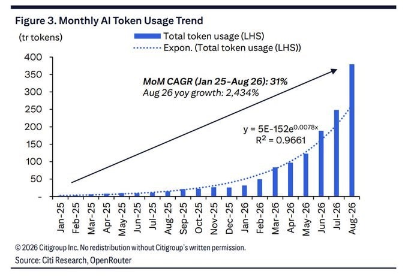

# 나는 자비스를 만들고 있다
## 부제: 서울에 사는 32세 서제호가 앞으로 30년을 살아가기 위해 하고 있는 것
### 발표 60분 강의안 (Q&A 없음)

> 화자: IBM Korea AI Engineer 서제호 과장이 아니라, 서울에 사는 32세 서제호.
> 주제: 자비스가 있냐 없냐를 논하는 게 아니라, 앞으로 30년을 살아가기 위해 자비스를 직접 만드는 중이라는 기록.
> 수단: Personal AI Factory / 궁극: 모두가 토큰을 많이 쓰는 세상의 생존법

---

## 강의 정보

- **시간:** 발표 60분 (Q&A 고려하지 않음)
- **대상:** AI를 써보긴 했는데 앞으로 30년을 어떻게 살아야 할지 고민하는 사람
- **목표:** "인터넷 사용자가 바뀌고 있다" 같은 거시 담론이 아니다. "나는 앞으로 30년을 위해 이런 걸 직접 하고 있다"를 보여준다.
- **핵심 한 줄:** 자비스가 존재하냐가 아니라, 그런 세상에서 살아남기 위해 자비스를 만드는 중이다.
- **마지막 질문:** 조직의 2~3%가 아닌 모두가 토큰을 많이 쓰는 세상이 오면, 당신은 무엇을 소유하고 있겠는가?

### 타임테이블 (60분)

| 시간 | 구간 | 내용 |
|---|---|---|
| 0-5분 | 오프닝 | 나는 누구인가 - 2008 vs 2026, 왜 이 얘기를 하는가 |
| 5-15분 | 1장 | 왜 자비스를 만드는가 - 30년 생존이 목적이다 |
| 15-27분 | 2장 | 수단은 AI 팩토리다 - 지능은 임대, 생산은 소유 |
| 27-42분 | 3장 | 궁극은 토큰이다 - 900배, 서울대, 2~3% 독식 (코어) |
| 42-53분 | 4장 | 그래서 인터넷도 바뀐다 - Agent가 쓰는 웹 |
| 53-60분 | 5장+클로징 | 비서가 아니라 파트너로 - 30년 선언 |

---

## 0. 오프닝 (0-5분)

### 스크립트

> 안녕하세요. 서울에 사는 32세 서제호입니다.
> IBM 명함 얘기를 하려는 게 아닙니다. 앞으로 30년을 어떻게 살아갈지 고민하는 한 개인의 얘기입니다.
>
> 2008년 아이언맨의 자비스는 SF였습니다.
> 2026년 저는 제 목소리를 학습시켜 강의를 만들고, 코드를 작성시키고, 문서를 분석시키고, 휴대폰으로 PC를 제어합니다.
>
> 그래서 오늘 주제는 "자비스가 있냐 없냐"가 아닙니다.
> "그런 세상에서 살아남기 위해 나는 자비스를 만들고 있다"입니다.

### 전달 포인트

- 직함·회사 어필 금지. 나이·도시·30년이라는 개인 서사로 시작
- 청중 질문: "여러분 조직에서 AI 토큰 제일 많이 쓰는 2~3%는 누구인가요? 여러분은 몇 %인가요?"
- 예고: 오늘 팁 얘기 안 합니다. 생존 얘기 합니다.

### 슬라이드

1. 2008 자비스 5기능 vs 2026 나의 스택 (TTS-강의-Claude Code-로컬LLM-RICE)
2. 이 강의의 지도: 목적(30년) → 수단(팩토리) → 궁극(토큰 세상)

---

## 1장. 왜 자비스를 만드는가 (5-15분)

### 핵심 메시지

> 목적은 멋진 비서가 아니다. 앞으로 30년을 버틸 개인 생산 기반이다.

### 스크립트 요지

모델은 1~2년마다 바뀝니다. 오늘 최고가 내일 최고가 아닙니다.
그래서 특정 모델 잘 쓰는 법에 베팅하면 30년을 못 갑니다.

제가 베팅하는 건 하나입니다:
**새로운 지능이 나올 때마다 흡수해서 결과물을 더 싸게 더 많이 만들어내는 능력.**

자비스는 그 능력의 이름입니다. 챗봇이 아니라 운영체계입니다.

### 왜 30년인가

- 32세 → 62세까지 일한다고 보면 약 30년
- 그 사이 모델, 하드웨어, 직업, 과금정책은 전부 바뀜
- 안 바뀌는 것에 투자해야 함: 내 코드, 내 데이터, 내 판단기록, 내 파이프라인, 내 교체권

> 자세한 철학은 `나의 자세.md` 2장(30년 생존 전략), 8장(커리어)에 원문이 있음. 강의에선 3줄로 압축.

### 한 줄 정리

> 자비스 논쟁에 참여하려는 게 아니라, 자비스가 당연한 세상에서 도태되지 않으려는 겁니다.

---

## 2장. 수단은 AI 팩토리다 (15-27분)

### 핵심 메시지

> 지능은 임대하고, 생산은 소유한다.

### 구조 (쉽게)

```
나의 의도
  ↓
프론티어 지능의 판단과 계획 (Claude/GPT/Gemini - 필요할 때 빌린다)
  ↓
로컬 런타임의 실행과 통제 (내 PC - 내가 소유한다)
  ↓
특화 엔진 대량 생산 (TTS/이미지/3D/영상/음악/투자분석)
  ↓
검증, 수정, 저장, 재사용
```

### 내 실제 예시 (꼭 시연/사진)

1. 강의 1편: 대본 → Qwen3-TTS 내 목소리 → Whisper로 재전사해 오류구간만 재생성 → FLUX 썸네일 → 자막·배포는 Claude Code
2. 투자: 스크래퍼+DART+시계열은 코드가 계산 → 모델은 가설·반박·리스크 판단만 → 리포트+차트+TTS+영상으로 조립

### 철학 3줄

1. 계산은 코드로, 생산은 특화모델로, 판단은 가장 적합한 지능으로
2. 특정 모델·프레임워크에 종속 금지 (Agent Loop, Tool/Skill Registry 직접 소유)
3. 추가 1건당 외부 과금이 0원에 수렴하는 구조가 목표 (완전 무료가 아니라 예측 가능성)

### 냉정한 코멘트 1분

- 로컬도 공짜 아님: 하드웨어+감가+전기+저장+유지보수
- 클라우드 가격 폭락하면 우위 줄 수 있음 → 항상 실측
- 공장 만들기가 목적되면 망함 → 결과물·절감액으로 평가

### 한 줄 정리

> 팩토리는 자랑용이 아니다. 토큰을 많이 써도 버틸 수 있는 몸을 만드는 과정이다. 다음 장이 그 이유다.

---

## 3장. 궁극은 토큰이다 (27-42분) - 이번 강의의 코어

### 핵심 메시지

> 아직은 2~3%가 토큰을 독식한다. 곧 모두가 많이 쓰는 세상이 온다. 그때를 준비하는 게 팩토리다.

### 3-1. 900배 예측

- YC에서 샘 알트먼이 언급한 취지: 앞으로 토큰 사용량이 지금의 900배 이상으로 늘어날 것
- 해석: 모델이 똑똑해져서 토큰이 줄어드는 게 아니라, 에이전트가 대신 일하면서 토큰이 폭발한다
- 인간 비유: 카메라 사려고 쇼핑몰 5개 vs 에이전트는 5,000개 긁고 비교·요약
- 슬라이드 문구: "토큰은 비용이 아니라 앞으로 30년의 전기세다"

> 발표 전 출처·정확한 수치·연도 표기 확인할 것. 슬라이드에 원문 캡처 + 연도 명시.

### 3-2. 토큰 폭발 증거



- Monthly AI Token Usage Trend (Citi Research, OpenRouter, 2026)
- Jan-25 → Aug-26 MoM CAGR **31%**, Aug-26 YoY **+2,434%**
- 멘트: "사람이 24배 더 쓴 게 아니다. 대리인이 대신 쓰기 시작한 거다."
- Cloudflare 보조지표: Bot 57.5% vs Human 42.5%, 예상(2027)보다 조기 도래

### 3-3. 서울대 사례 - 무제한이 한 달 만에 고갈

- 올해 서울대가 1년 무제한 GPT 사용을 보장했다가 1달 만에 고갈 → 사용량 제한으로 전환한 사례
- 포인트 3개:
  1. 수요 예측 실패: 무제한 주면 이렇게까지 쓰는지 아무도 몰랐다
  2. 과금·정책 리스크: 외부 정책 하나로 생산이 멈출 수 있다
  3. 그래서 로컬·하이브리드: 민감·반복·대량은 로컬, 고난도 판단만 클라우드
- 멘트: "학교도 못 버티는 사용량을 개인은 어떻게 버티겠는가? 그래서 생산단가를 소유해야 한다."

> 발표 전 학기·대상·제한 방식 팩트체크 후 슬라이드에 각주.

### 3-4. 지금은 2~3%가 독식한다

-現状: 조직 안에서 토큰 많이 쓰는 2~3%가 대부분 사용량을 차지
- 이유: 쓸 줄 아는 사람·권한 있는 사람·실험할 시간 있는 사람만 씀
- 미래: 에이전트 + 팩토리가 보급되면 모두가 많이 쓰는 세상이 옴
  - 기획자도, 학생도, 1인 사업가도 에이전트 돌림
  - 그때 격차는 "모델 접근"이 아니라 "생산체계 + 판단기록 + 교체능력"에서 벌어짐
- 질문 던지기: "여러분 팀에서 토큰 상위 3%는 누구인가? 그 노하우가 개인에게 남는가, 회사 과금계정에만 남는가?"

### 한 줄 정리

> 900배 세상에서 살아남는 법은 토큰 아끼기가 아니라 토큰 많이 써도 되는 몸을 미리 만드는 것이다. 그 몸이 2장의 팩토리다.

---

## 4장. 그래서 인터넷도 바뀐다 (42-53분)

### 핵심 메시지

> 토큰 세상에서는 인간이 아니라 에이전트가 인터넷의 주 사용자가 된다.

### 요지 (11분 압축)

1. 현재 웹 = 인간용 (HTML/CSS/JS/광고/팝업)
2. Agent가 원하는 건 기능 호출 (구조화 데이터, 인증, 액션)
   - 현재: Agent → 크롤링 → HTML 파싱
   - 미래: Agent → MCP Server → 정형 반환 (WebMCP 흐름)
3. CAPTCHA 종말: 인간증명 → 좋은 Agent 허용 / 나쁜 Agent 차단 (Identity, Reputation, 암호학적 증명, Economic Cost)
4. 돈의 이동: 광고·PV → Pay Per Crawl / Agent 구독 / Premium API / Verified Feed
5. SEO → LLMO / Agent Readability 시대

### 토큰장과 연결 멘트

> 토큰 900배 세상에서는 사람이 검색결과를 안 봅니다. 에이전트가 수천 사이트 돌고 한 줄로 줍니다. 웹사이트는 사람을 설득하는 게 아니라 에이전트를 설득해야 합니다.

---

## 5장. 비서가 아니라 파트너로 (53-60분)

### 핵심 메시지

> 실리콘밸리는 비서·직원·노예라 부른다. 나는 파트너로 만든다.

### 스크립트 요지

토니 스타크는 자비스에게 업무를 시킵니다. 하지만 후반으로 갈수록 자비스는 도구가 아니라 파트너입니다. 비판하고, 빈틈 메우고, 먼저 판단합니다.

직원 비유는 효율적이지만 위험합니다. 직원은 시키는 것만 합니다. 파트너는 내 판단을 진화시킵니다.

그래서 제 팩토리는:
- 판단 이유, 데이터, 모델·프롬프트 버전, 예상vs실제, 실패를 전부 저장
- 시간이 지날수록 쌓이는 건 모델이 아니라 나의 판단 자산

### 30년 선언 (클로징 2분)

> 나는 모든 지능을 소유하려 하지 않는다.
> 나의 코드, 실행환경, 데이터, 판단기록, 파이프라인, 생성자산, 비용구조, 교체권을 소유한다.
>
> **지능은 임대한다. 생산설비는 소유한다. 결과와 기억은 축적한다.**
>
> 32세 서제호의 목표는 AI를 잘 쓰는 2~3%에 드는 게 아니다.
> 모두가 토큰을 많이 쓰는 세상에서 30년을 버티는 몸을 만드는 것이다.
> 그 몸의 이름이 자비스고, 공장이 AI 팩토리다.

### 마지막 슬라이드

- 당장 1개: TTS+Whisper 검증 파이프라인 1개 완성 → 판단 기록 저장부터
- 이 강의안이 그 1호 기록이다

---

## 부록: 용어 1줄

- MCP / WebMCP: 에이전트가 웹 기능을 구조화 호출하는 표준
- LLMO: LLM이 잘 인용하도록 최적화
- Pay Per Crawl: AI가 읽을 때 과금
- RICE: Agent Loop/Tool·Skill Registry/검증·복구 직접 소유 철학
- Compound AI: 대형 1개보다 특화 N개+코드+검증 조합

## 출처·확인 메모 (발표 전 필수)

- [ ] 샘 알트먼 YC 900배 발언 원문·날짜·맥락 확보
- [ ] 서울대 무제한 GPT 고갈·제한 전환 학기·범위·기사 확보
- [ ] 2~3% 독식: 조직 내부 실측인지 일반론인지 명시 (자신의 사용량 로그 있으면 공개)
- [ ] token사용량.jpeg: Citi Research/OpenRouter 표기 유지, 무단 재배포 문구 확인
- [ ] `나의 자세.md`는 원본 철학 보관용으로 유지, 강의안은 이 파일이 정본
